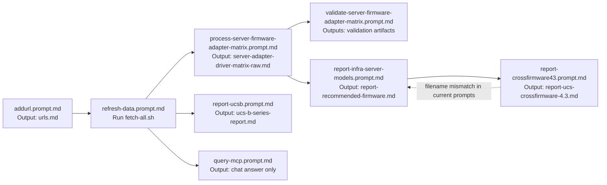

# Prompt Dependency Evaluation

This document evaluates every prompt in .github/prompts and maps:
- Input files each prompt reads
- Output files each prompt writes
- Producer/consumer relationships between prompts
- Suggested end-to-end execution order

## Inventory

- .github/prompts/addurl.prompt.md
- .github/prompts/process-server-firmware-adapter-matrix.prompt.md
- .github/prompts/query-mcp.prompt.md
- .github/prompts/refresh-data.prompt.md
- .github/prompts/report-crossfirmware43.prompt.md
- .github/prompts/report-infra-server-models.prompt.md
- .github/prompts/report-ucsb.prompt.md
- .github/prompts/validate-server-firmware-adapter-matrix.prompt.md

# addurl.prompt.md - Add one or more URLs into the master URL list

```text
addurl.prompt.md
├─ Inputs
│  ├─ User-supplied URL(s)
│  └─ urls.md (existing headings and links for placement and dedupe)
└─ Outputs
   └─ urls.md (new markdown link entries)
```

Input files:
- urls.md

Output files:
- urls.md

Consumed by:
- No direct downstream prompt consumes urls.md explicitly, but it is a source-of-truth input for data refresh workflows.

# refresh-data.prompt.md - Refresh repository data by running fetch-all.sh

```text
refresh-data.prompt.md
├─ Inputs
│  ├─ fetch-all.sh
│  ├─ fetch-cisco-docs.py
│  └─ recommended-firmware/fetch-*.py
└─ Outputs
   ├─ ucs-docs/* (refreshed docs)
   ├─ recommended-firmware/* (refreshed recommended data artifacts)
   └─ Other fetched artifacts produced by fetch-all.sh
```

Input files:
- fetch-all.sh
- fetch-cisco-docs.py
- recommended-firmware/fetch-imm.py
- recommended-firmware/fetch-ucsm.py

Output files:
- Multiple refreshed data files (script-driven), including refreshed UCS docs and recommended-firmware artifacts.

Consumed by:
- report-ucsb.prompt.md (queries MCP content that depends on refreshed docs)
- query-mcp.prompt.md (depends on current UCS docs in MCP)
- process-server-firmware-adapter-matrix.prompt.md indirectly (depends on refreshed jsondata when refresh process updates it)

# process-server-firmware-adapter-matrix.prompt.md - Build raw UCS server/adapter/driver matrix

```text
process-server-firmware-adapter-matrix.prompt.md
├─ Inputs
│  └─ jsondata/*.json (excluding specific matrix/control files)
├─ Intermediate Output
│  └─ extract_server_data.py (generated script)
└─ Final Output
   └─ ucs-firmware-reports/server-adapter-driver-matrix-raw.md
```

Input files:
- jsondata/*.json
- Excludes:
  - jsondata/UCS-Equivalency-Matrix.json
  - jsondata/ucsmupgradematrix.json
  - jsondata/ucsmcrossver.json

Output files:
- extract_server_data.py
- ucs-firmware-reports/server-adapter-driver-matrix-raw.md

Consumed by:
- validate-server-firmware-adapter-matrix.prompt.md
- report-infra-server-models.prompt.md

# validate-server-firmware-adapter-matrix.prompt.md - Validate markdown matrix against JSON source data

```text
validate-server-firmware-adapter-matrix.prompt.md
├─ Inputs
│  ├─ ucs-firmware-reports/server-adapter-driver-matrix-raw.md
│  └─ jsondata/ucsm-*.json
└─ Outputs
   ├─ validate_firmware_data.py
   ├─ VALIDATION_README.md
   └─ validation_report.txt (or redirected report output)
```

Input files:
- ucs-firmware-reports/server-adapter-driver-matrix-raw.md
- jsondata/ucsm-*.json

Output files:
- validate_firmware_data.py
- VALIDATION_README.md
- validation_report.txt

Consumed by:
- Primarily human review and quality gates before downstream report generation.

# report-infra-server-models.prompt.md - Generate recommended firmware report

```text
report-infra-server-models.prompt.md
├─ Inputs
│  ├─ ucs-firmware-reports/recommended-firmware.md
│  ├─ ucs-firmware-reports/ucs-crossfirmware-4.3.md
│  └─ ucs-firmware-reports/server-adapter-driver-matrix-raw.md
└─ Outputs
   └─ ucs-firmware-reports/report-recommended-firmware.md
```

Input files:
- ucs-firmware-reports/recommended-firmware.md
- ucs-firmware-reports/ucs-crossfirmware-4.3.md
- ucs-firmware-reports/server-adapter-driver-matrix-raw.md

Output files:
- ucs-firmware-reports/report-recommended-firmware.md

Consumed by:
- report-crossfirmware43.prompt.md

# report-crossfirmware43.prompt.md - Build UCSM 4.3 cross-version compatibility report

```text
report-crossfirmware43.prompt.md
├─ Inputs
│  ├─ ucs-firmware-docs/Cisco UCS Manager Cross-Version Firmware Support, Release 4.3 - Cisco.html
│  └─ ucs-firmware-reports/report-recommended-firmware.md
└─ Outputs
   └─ ucs-firmware-reports/report-ucs-crossfirmware-4.3.md
```

Input files:
- ucs-firmware-docs/Cisco UCS Manager Cross-Version Firmware Support, Release 4.3 - Cisco.html
- ucs-firmware-reports/report-recommended-firmware.md

Output files:
- ucs-firmware-reports/report-ucs-crossfirmware-4.3.md

Consumed by:
- Intended to feed infra report logic, but current consumer prompt reads ucs-crossfirmware-4.3.md (different filename).

# report-ucsb.prompt.md - Generate UCS B-series report from MCP UCS docs

```text
report-ucsb.prompt.md
├─ Inputs
│  └─ MCP ucs-docs content (UCS B-series, firmware, OS/hypervisor, adapters)
└─ Outputs
   └─ ucs-firmware-reports/ucs-b-series-report.md
```

Input files:
- No direct filesystem input required by prompt text
- Runtime source is MCP server data (ucs-docs)

Output files:
- ucs-firmware-reports/ucs-b-series-report.md

Consumed by:
- Standalone report output for users.

# query-mcp.prompt.md - Interactive UCS docs Q and A through MCP

```text
query-mcp.prompt.md
├─ Inputs
│  ├─ User question
│  └─ MCP ucs-docs content
└─ Outputs
   └─ Answer in chat (with filename/line citations and reasoning)
```

Input files:
- No required local files
- MCP docs index/content

Output files:
- No repository file output required
- Chat response only

Consumed by:
- User interaction only (no downstream prompt dependency)

## Producer to Consumer Map

- process-server-firmware-adapter-matrix.prompt.md -> validate-server-firmware-adapter-matrix.prompt.md
  - Produces ucs-firmware-reports/server-adapter-driver-matrix-raw.md

- process-server-firmware-adapter-matrix.prompt.md -> report-infra-server-models.prompt.md
  - Produces ucs-firmware-reports/server-adapter-driver-matrix-raw.md

- report-infra-server-models.prompt.md -> report-crossfirmware43.prompt.md
  - Produces ucs-firmware-reports/report-recommended-firmware.md

- report-crossfirmware43.prompt.md -> report-infra-server-models.prompt.md (intended, but mismatched filename)
  - Produces ucs-firmware-reports/report-ucs-crossfirmware-4.3.md
  - Consumer expects ucs-firmware-reports/ucs-crossfirmware-4.3.md

## Recommended Execution Order

The following order makes dependencies explicit and minimizes stale data:

1. addurl.prompt.md (optional, when adding new source URLs)
2. refresh-data.prompt.md
3. process-server-firmware-adapter-matrix.prompt.md
4. validate-server-firmware-adapter-matrix.prompt.md
5. report-infra-server-models.prompt.md
6. report-crossfirmware43.prompt.md
7. report-ucsb.prompt.md
8. query-mcp.prompt.md (on demand, any time after refresh)

## Notes on Dependency Gaps

- report-crossfirmware43.prompt.md writes report-ucs-crossfirmware-4.3.md.
- report-infra-server-models.prompt.md reads ucs-crossfirmware-4.3.md.
- Because those filenames differ, there is no strict file handoff unless one of these is done:
  - Align output filename in report-crossfirmware43.prompt.md to ucs-crossfirmware-4.3.md, or
  - Align input filename in report-infra-server-models.prompt.md to report-ucs-crossfirmware-4.3.md.

## End-to-End Swimlane



## Prompt Dependency Summary Tree

```text
Prompt Pipeline
├─ addurl.prompt.md
│  └─ outputs: urls.md
├─ refresh-data.prompt.md
│  └─ outputs: refreshed docs/data artifacts
├─ process-server-firmware-adapter-matrix.prompt.md
│  ├─ input: jsondata/*.json
│  └─ output: ucs-firmware-reports/server-adapter-driver-matrix-raw.md
├─ validate-server-firmware-adapter-matrix.prompt.md
│  ├─ inputs: server-adapter-driver-matrix-raw.md + jsondata/ucsm-*.json
│  └─ outputs: validation scripts/reports
├─ report-infra-server-models.prompt.md
│  ├─ inputs: recommended-firmware.md + ucs-crossfirmware-4.3.md + server-adapter-driver-matrix-raw.md
│  └─ output: report-recommended-firmware.md
├─ report-crossfirmware43.prompt.md
│  ├─ inputs: UCSM 4.3 HTML + report-recommended-firmware.md
│  └─ output: report-ucs-crossfirmware-4.3.md
├─ report-ucsb.prompt.md
│  ├─ input: MCP ucs-docs
│  └─ output: ucs-b-series-report.md
└─ query-mcp.prompt.md
   ├─ inputs: user query + MCP ucs-docs
   └─ output: chat response
```